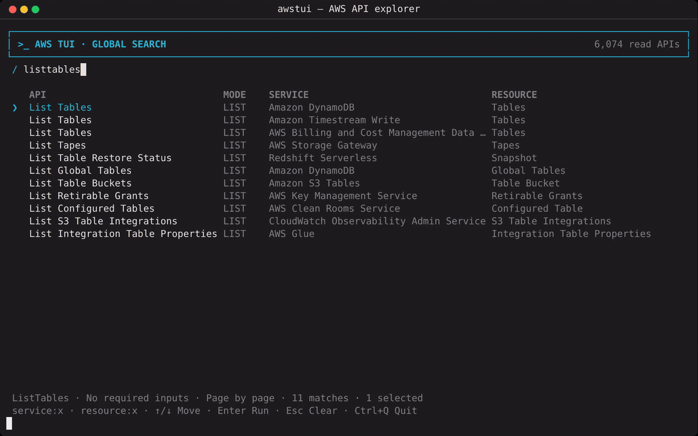
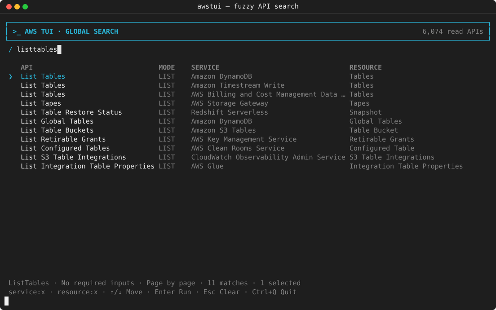
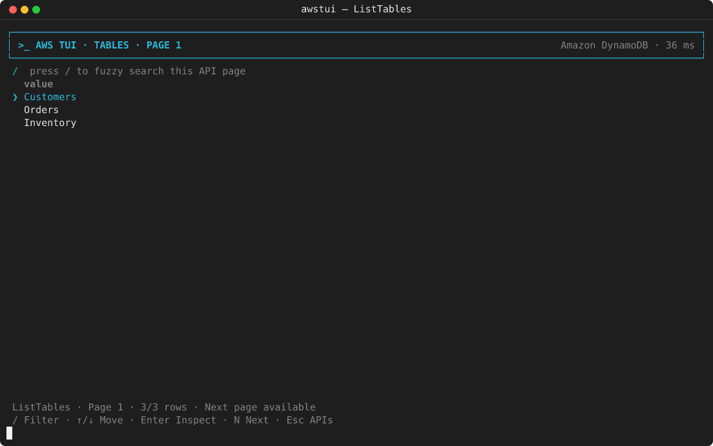
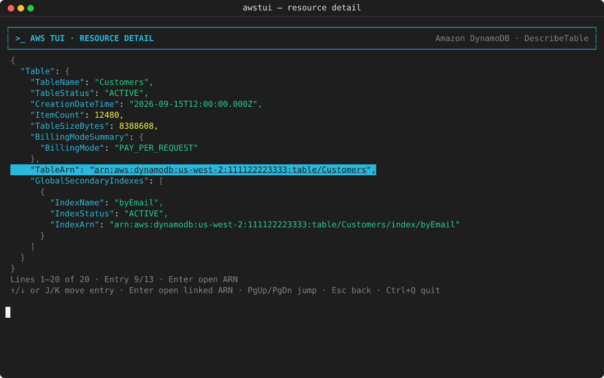

# aws-cli-tui

Search-first terminal UI for read-only AWS APIs.

The operation catalog is generated from the public
[`aws/api-models-aws`](https://github.com/aws/api-models-aws) Smithy JSON AST. Users search across API and resource
names with one fuzzy, typo-tolerant no-space token. Exact normalized matches rank first. AWS service names are not a
navigation level; the resolved service appears on operation and resource detail views.

## Demo

<a href="docs/assets/awstui-demo.mp4">
  
</a>

Click the animation to open the MP4. The screenshots and recording were
captured with TUI Harness using synthetic AWS responses; they contain no
customer or account data.

### Fuzzy API search



### Paginated List view



### Focusable JSON detail



## Requirements

- Node.js 20 or later
- AWS CLI v2 on `PATH`
- Configured AWS credentials

## Install from GitHub

Install the `awstui` command globally:

```bash
npm install --global github:jariy17/aws-cli-tui
```

If this checkout was previously installed with `npm link`, unlink that
development installation once before switching to the GitHub package:

```bash
npm unlink --global aws-cli-tui
npm install --global github:jariy17/aws-cli-tui
```

Then launch it with an AWS CLI profile and region:

```bash
awstui --profile my-profile --region us-west-2
```

The tool uses the AWS CLI's existing credential chain. Configure credentials
first with `aws configure`, `aws configure sso`, or your usual profile setup.

## Install from a clone

```bash
git clone https://github.com/jariy17/aws-cli-tui.git
cd aws-cli-tui
npm ci
npm link

awstui --profile my-profile --region us-west-2
```

To run without creating a global link:

```bash
npm start -- --profile my-profile --region us-west-2
```

Type a no-space search such as `agentruntime`, `listagentruntimes`, `tables`, or `buckets`. Typos and abbreviated
subsequences such as `agentruntmie` or `agntrntm` are supported.

The search view uses the same flat table layout as List pages. It reserves fixed
rows, shows API, mode, and service in columns, and keeps the selected
operation's input/pagination summary beneath the table.

Search and List tables fill the available terminal height regardless of result
count. The bottom three rows are reserved for status, help, and the hidden
debug line.

Prefix a no-space query with `service:` or `resource:` to scope it:

```text
service:sns
resource:topic
```

The Resource column uses formal Smithy resource-operation relationships when
available and falls back to the operation-derived resource name.

## Direct commands

```bash
# Parameterless List API; returns the first API page as JSON
awstui list agentruntime --profile my-profile --region us-west-2

# Get/Describe API; repeat --input for required identifiers
awstui get agentruntime \
  --input agentRuntimeId=my-runtime-id \
  --profile my-profile \
  --region us-west-2
```

List operations with required API inputs are excluded from the catalog. Continuation tokens are managed internally in
the TUI: `N` loads the next API page and `B` returns to the cached previous page. Press `/` on a List page to fuzzy
search only the rows already loaded for that page; this never makes another AWS request.

Pressing Enter on a scalar List row can open its related detail API when that
API has exactly one compatible required input. For example, a DynamoDB table
name from `ListTables` is passed to `DescribeTable` as `TableName`.

## TUI controls

- Type letters or numbers: update the global fuzzy no-space search
- Up/Down: select a matching API, list row, or JSON entry
- Enter: run an API or open/get the selected row
- `/` on a List page: fuzzy search the current page
- `N` / `B`: next/previous list page
- Escape: clear search or go back
- Ctrl+Q: quit

The detail page shows:

- Friendly AWS service title and Smithy operation in the header
- Syntax-colored, pretty-printed resource or Get response JSON
- Focusable JSON entries, with verified ARN values available to open

On a detail page, only ARNs that resolve to an unambiguous read operation are
highlighted and selectable. Other ARN strings, such as a DynamoDB `IndexArn`
without a direct index read API, remain ordinary JSON. The resolver checks the
current public Smithy model on GitHub for the source and target services,
follows `aws.api#arnReference` to a resource `read` operation when available,
and otherwise uses a conservative ARN/service/Get-or-Describe fallback. Models
are conditionally cached with GitHub ETags, so every drill-through checks for a
newer model without redownloading unchanged JSON.

Smithy model directory names and AWS CLI service commands are stored
separately. For example, the public model lives under `dynamodb-streams`, while
execution correctly uses `aws dynamodbstreams`.

## Refresh the Smithy catalog

Clone the public model repository, then regenerate:

```bash
git clone --depth 1 --filter=blob:none --sparse \
  https://github.com/aws/api-models-aws.git /tmp/api-models-aws
git -C /tmp/api-models-aws sparse-checkout set models
npm run models:generate -- /tmp/api-models-aws
```

The generated catalog records the source repository and commit SHA.

## Development

```bash
npm run typecheck
npm test
npm run build
```
